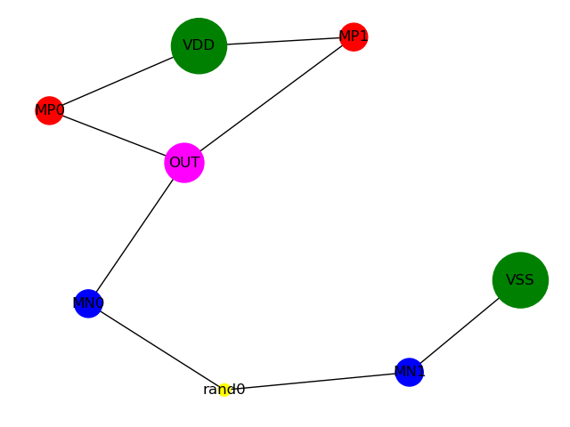

```
                               .d8888b.        d8888  .d8888b.   .d8888b.  
                              d88P  Y88b      d88888 d88P  Y88b d88P  Y88b 
                              Y88b.          d88P888 Y88b.      888    888 
                               "Y888b.      d88P 888  "Y888b.   888        
                                  "Y88b.   d88P  888     "Y88b. 888        
                                    "888  d88P   888       "888 888    888 
                              Y88b  d88P d8888888888 Y88b  d88P Y88b  d88P 
                               "Y8888P" d88P     888  "Y8888P"   "Y8888P" 

                                    SPICE Automatic Stack Calculator
```

This tool parses a SPICE description and turns them into a transistor object list, one list for Pull-Down Network (PDN) and one for Pull-Up Network (PUN). A node graph is generated and them the tool finds Eulerian Paths, between PDN and PUN common nodes to the VDD and VSS rails, to calculate the Stack Factor and properly size transistor widths. 

**Fig. I - Node Graph Generated by a NAND2 SPICE Input**



To properly run the tool, execute the following command: 

>python3 sasc.py [Wpmos/Wnmos Ratio] [Input SPICE]

The default value for "Wp/Wn Ratio" is 2. 

Spice Description should contain a section describing i/o and supply pins.

>*.pininfo A:I B:I OUT:O VSS:G VDD:P

Where ":I" stands for Inputs, ":O" for outputs, ":G" for Ground, and ":P" for Power.
